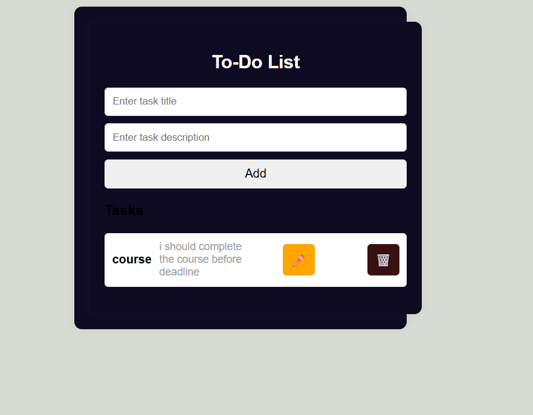

# ✅ To-Do List Application

A simple and secure **To-Do List App** that allows users to create, read, update, and delete tasks using HTTP Methods

## 🚀 Features

- 📌 **Create / Read / Update / Delete (CRUD)** tasks
- 🧾 Task management with user-specific data
- 🌐 Fully responsive UI

## 🛠️ Tech Stack

- **Frontend:** React.js, Fetch API
- **Backend:** Node.js, Express.js
- **Database:** MongoDB

